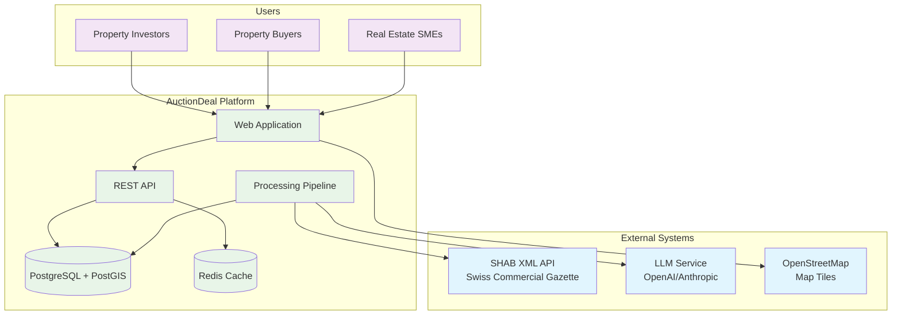
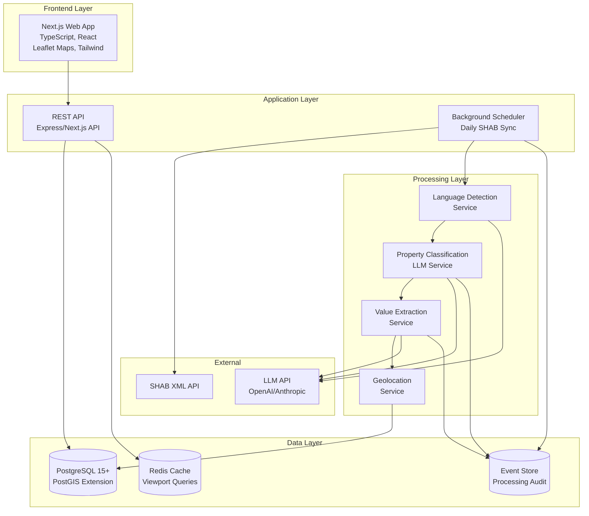
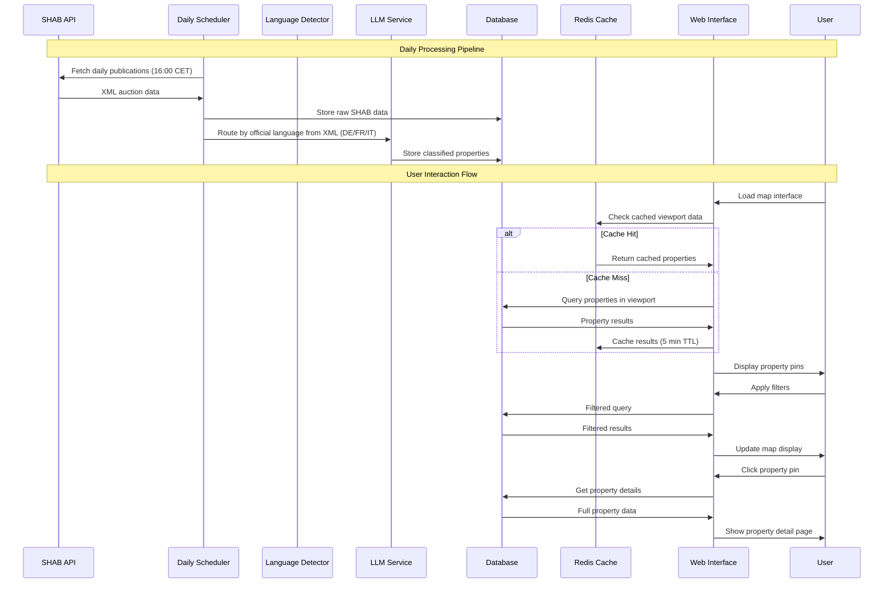
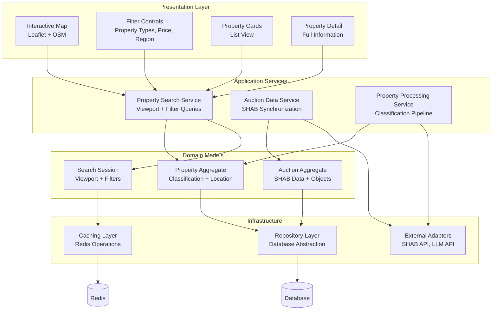
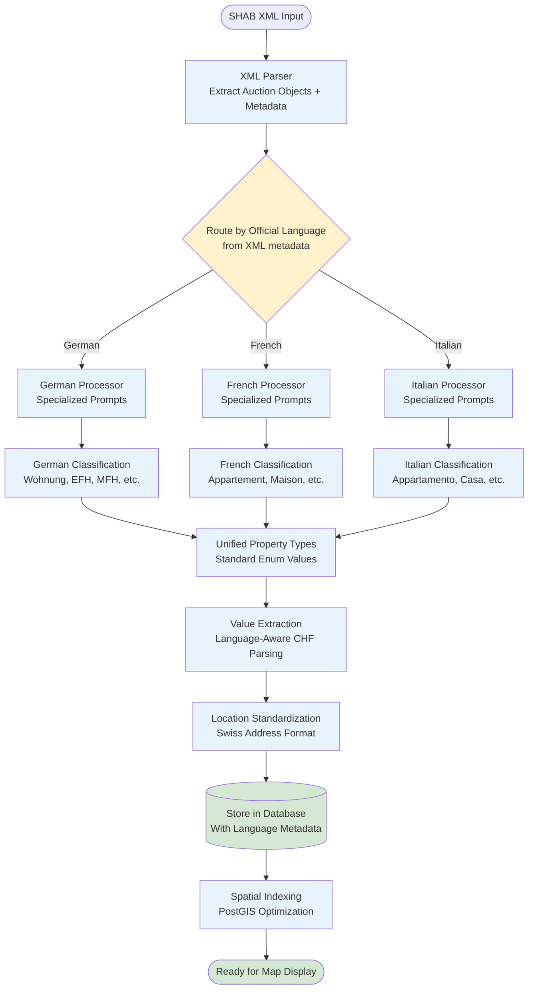
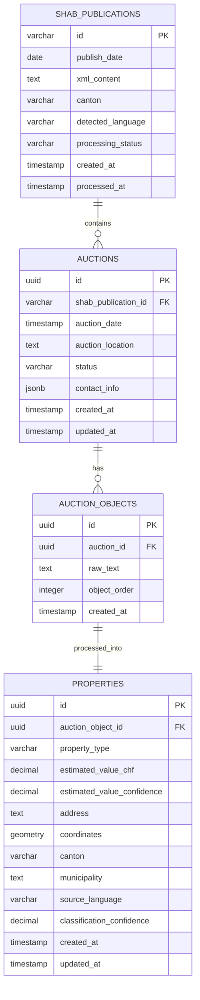
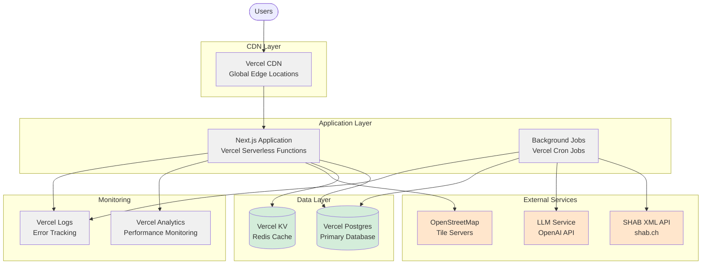

# AuctionDeal Architecture Diagrams

## System Context Diagram

## Container Architecture Diagram

## Data Flow Diagram

## Component Architecture Diagram

## Multi-Language Processing Architecture

## Database Entity Relationship Diagram

## Deployment Architecture Diagram

These diagrams provide visual representation of the AuctionDeal system architecture from different perspectives, supporting the implementation team with clear technical guidance.