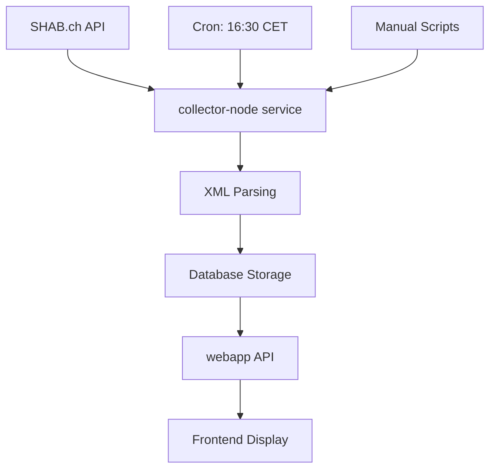

# AuctionDeal Project Index

*Generated from actual codebase structure - Updated 2025-09-10*

## Project Overview

AuctionDeal is a service-oriented application for Swiss auction data collection and processing, built with a microservices architecture using TypeScript and Python.

## Architecture & Structure

### Root Directory Structure
```
auctiondeal/
├── services/           # Microservices
│   ├── webapp/        # Next.js web application
│   └── collector-node/ # SHAB data collection service
├── libs/              # Shared libraries
│   ├── shared-ts/     # TypeScript shared utilities
│   ├── shared-py/     # Python shared utilities
│   └── contracts/     # JSON schema contracts
├── db/               # Database schema and migrations
├── docs/             # Project documentation
├── ops/              # Infrastructure and deployment
└── context/          # Development context files
```

## Services

### 1. Web Application (`services/webapp/`)

**Technology Stack:** Next.js 15.5.2, React 19, TypeScript, Tailwind CSS, Prisma
**Purpose:** Main user interface and API endpoints

**Key Components:**
- **Package:** `auctiondeal-app` v0.1.0
- **Main Features:**
  - Next.js App Router with API routes
  - React 19 with modern hooks
  - Leaflet maps for geographic data visualization
  - Form handling with React Hook Form + Zod validation
  - State management with Zustand
  
**Scripts & Data Management:**
```bash
# Data Operations
npm run data:backfill      # Backfill with default 90 days
npm run data:backfill:30   # Backfill 30 days
npm run data:clear         # Clear database
npm run data:status        # Check data status

# Testing Suite
npm run test:pipeline           # Test SHAB processing pipeline
npm run test:volume            # Test data volume handling
npm run test:duplicate-avoidance # Test duplicate prevention
npm run test:all              # Run comprehensive tests
```

**API Endpoints:**
- `src/app/api/cron/shab-sync/route.ts` - SHAB synchronization cron proxy (16:30 CET daily)

**Database Integration:**
- Prisma schema: `../../db/prisma/schema.prisma`
- Client generation via `@prisma/client`

### 2. SHAB Collector Service (`services/collector-node/`)

**Technology Stack:** Node.js, TypeScript, Winston logging, node-cron, Jest testing
**Purpose:** Standalone SHAB data collection and processing service

**Key Components:**
- **Package:** `@auctiondeal/collector-node` v1.0.0
- **Main Service:** `src/index.ts` - CollectorService with cron scheduling
- **API Client:** `src/lib/shab-api.ts` - ShabApiService for SHAB.ch API
- **Data Processor:** `src/lib/shab-processor.ts` - Data processing and database operations
- **Type Definitions:** `src/types/shab.ts` - SHAB API response types

**Service Features:**
- **Automated Collection:** Daily at 16:30 CET via node-cron
- **Historical Backfill:** Support for processing past data (default 90 days)
- **Error Handling:** Retry logic, cleanup jobs every 6 hours
- **Health Monitoring:** Status endpoints and periodic health checks
- **Graceful Shutdown:** SIGINT/SIGTERM handling with proper cleanup

**Testing Infrastructure:**
```bash
npm run test:unit          # Unit tests
npm run test:integration   # Integration tests  
npm run test:api          # API connectivity tests
npm run test:database     # Database tests
npm run test:all          # Complete test suite
```

**Dependencies:**
- Uses shared libraries: `@auctiondeal/contracts`, `@auctiondeal/shared-ts`
- XML parsing via `fast-xml-parser`
- Scheduling via `node-cron`

## Shared Libraries

### 1. TypeScript Shared Library (`libs/shared-ts/`)

**Package:** `@auctiondeal/shared-ts` v1.0.0
**Purpose:** Common TypeScript utilities for all services

**Core Modules:**
- **`src/db.ts`** - Prisma client wrapper with global instance management
  - `getPrismaClient()` - Singleton Prisma client
  - `DatabaseUtils` - Health checks and connection management
- **`src/validation.ts`** - Zod validation schemas
- **`src/telemetry.ts`** - Winston logging configuration
- **`src/index.ts`** - Re-exports all utilities

**Build Process:**
```bash
npm run build              # Prisma generate + TypeScript compilation
npm run prisma:generate    # Generate Prisma client
npm run prisma:db:push     # Push schema changes
```

### 2. Python Shared Library (`libs/shared-py/`)

**Package:** Shared Python utilities for future Python services
**Purpose:** Database utilities and common Python functionality

**Core Modules:**
- **`auctiondeal_shared/db.py`** - PostgreSQL database client using SQLAlchemy
  - `DatabaseClient` - Connection management and query execution
  - `DatabaseUtils` - Connection testing and utilities
- **`auctiondeal_shared/telemetry.py`** - Logging utilities
- **`auctiondeal_shared/validation.py`** - Data validation helpers

### 3. Contracts Library (`libs/contracts/`)

**Purpose:** JSON Schema contracts for data validation across services
**Technology:** JSON Schema with TypeScript and Python codegen

**Generated Types:**
- **TypeScript:** `codegen/ts/`
  - `auction.ts`, `auction-object.ts`, `shab-publication.ts`
- **Python:** `codegen/py/`
  - `auction_schema.py`, `auction_object_schema.py`, `shab_publication_schema.py`

**Schemas:** `schemas/`
- `auction.schema.json`
- `auction-object.schema.json` 
- `shab-publication.schema.json`

## Database Schema

**Location:** `db/prisma/schema.prisma`
**Database:** PostgreSQL with PostGIS extension
**ORM:** Prisma with client generation

**Core Models:**
```prisma
ShabPublication {
  id, publishDate, xmlContent, canton, rubric, subRubric
  officialLanguage, processingStatus, createdAt, processedAt
  → auctions[]
}

Auction {
  id, shabPublicationId, auctionDate, auctionLocation
  status, createdAt, updatedAt
  → shabPublication, auctionObjects[]
}

AuctionObject {
  id, auctionId, rawText, objectOrder, createdAt
  → auction, property?
}

Property {
  id, auctionObjectId, propertyType, classificationConfidence
  estimatedValueChf, valueConfidence, address, coordinates
  canton, municipality, sourceLanguage, createdAt, updatedAt
  → auctionObject
}
```

**Key Features:**
- PostGIS geometry support for coordinates
- Cascading deletes for data integrity
- Optimized indexes for common queries
- Confidence scoring for LLM-processed data

## Data Flow & Processing

### 1. SHAB Data Collection Pipeline



**Process Flow:**
1. **Daily Collection:** `collector-node` runs cron job at 16:30 CET
2. **API Fetching:** `ShabApiService` fetches publications from SHAB.ch
3. **XML Processing:** Parse XML content using `fast-xml-parser`
4. **Data Extraction:** Extract auction objects and property data
5. **Database Storage:** Store in PostgreSQL via Prisma
6. **Web Access:** `webapp` provides API endpoints for frontend

### 2. Historical Backfill

**Default:** 90 days historical data
**Usage:** Via `CollectorService.runHistoricalCollection(daysBack)`
**Scripts:** Multiple backfill and validation scripts in `webapp/scripts/`

## Development Environment

### Prerequisites
- Node.js (TypeScript services)
- Python 3.x (Python services)
- PostgreSQL with PostGIS
- Environment variables: `DATABASE_URL`, `CRON_SECRET`

### Local Development Setup

```bash
# Install dependencies
cd services/webapp && npm install
cd services/collector-node && npm install  
cd libs/shared-ts && npm install

# Database setup
cd db && npx prisma generate && npx prisma db push

# Build shared libraries
cd libs/shared-ts && npm run build
cd libs/contracts && npm run build

# Start services
cd services/webapp && npm run dev          # Next.js dev server
cd services/collector-node && npm run dev # Collector service
```

### Testing Strategy

**Unit Tests:** Jest-based testing for individual components
**Integration Tests:** End-to-end pipeline testing
**Manual Testing Scripts:** Comprehensive validation scripts in webapp
**API Testing:** Direct SHAB API connectivity validation
**Database Testing:** Connection and query validation

## Key Integrations

### External APIs
- **SHAB.ch API:** Swiss Commercial Gazette official API
  - Base URL: `https://www.shab.ch/api/v1/publications`
  - XML content parsing for auction data
  - Rate limiting and retry logic implemented

### Libraries & Dependencies

**Frontend (webapp):**
- Next.js 15.5.2, React 19, Tailwind CSS 4
- Leaflet maps, Radix UI components
- React Hook Form + Zod validation
- Zustand state management

**Backend (collector-node):**
- Winston logging, node-cron scheduling
- fast-xml-parser for SHAB XML content
- Jest testing framework

**Shared:**
- Prisma ORM with PostgreSQL
- TypeScript throughout
- Zod schema validation

## Deployment & Infrastructure

**Current State:** Development environment setup
**Cron Jobs:** 
- Daily SHAB collection: 16:30 CET
- Cleanup jobs: Every 6 hours

**Environment Configuration:**
- `DATABASE_URL` - PostgreSQL connection
- `CRON_SECRET` - Authentication for cron endpoints
- `NODE_ENV` - Environment mode

## Documentation Structure

### Core Documentation (`docs/`)
- `auctiondeal_prd1.md` - Main Product Requirements Document
- `auctiondeal_architecture.md` - Technical architecture details
- `shab-api-interface.md` - SHAB API integration documentation
- `domain_model_interfaces.md` - Data model documentation

### Development Context (`context/`)
- `prd_template.md` - PRD template structure
- Sample XML files from SHAB for reference

### Project Management (`.claude/`)
- `tasks/` - Implementation task tracking
- `commands/` - Custom Claude commands
- `settings.local.json` - Local development settings

---

*This index reflects the actual codebase structure as of September 2025. The architecture shows a well-structured service-oriented application with clear separation of concerns, comprehensive testing, and robust data processing capabilities.*